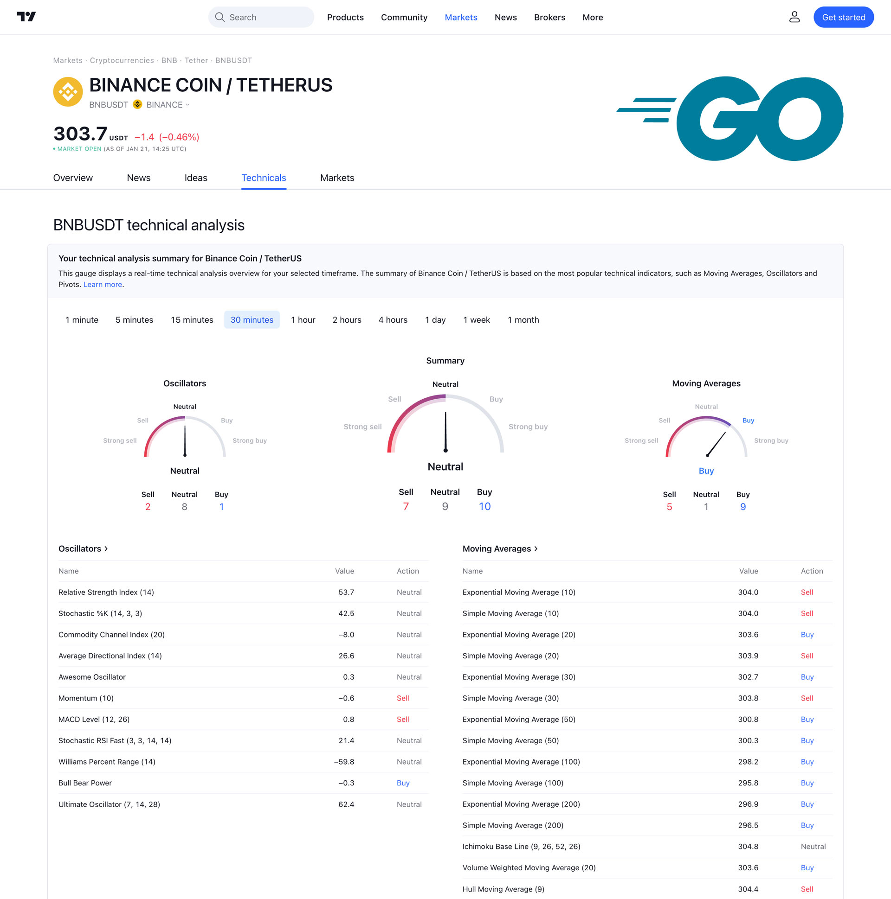

<p align="center">
  
</p>

<h1 align="center">go-tradingview-ta</h1>

<p align="center">
  A focused Go client for TradingView scanner data.
  Fetch normalized recommendation signals and raw indicator values with a small,
  idiomatic API.
</p>

<p align="center">
  <a href="https://pkg.go.dev/github.com/artlevitan/go-tradingview-ta">
    
  </a>
  
  
  
</p>

`go-tradingview-ta` is an unofficial Go client for TradingView's public scanner
endpoint. It retrieves both normalized recommendation signals and the raw
indicator values returned by TradingView.

The zero values of `TradingView` and `Client` are ready to use.

## Why This Package

- Small API surface with an idiomatic Go layout.
- Raw numeric values and normalized `Strong Sell` to `Strong Buy` signals.
- Support for daily and intraday intervals.
- Configurable HTTP client for tests, custom transports, and alternative endpoints.

## Installation

```bash
go get github.com/artlevitan/go-tradingview-ta@latest
```

## Quick Start

```go
package main

import (
	"fmt"
	"log"

	tradingview "github.com/artlevitan/go-tradingview-ta"
)

func main() {
	var ta tradingview.TradingView

	if err := ta.Get("BINANCE:BTCUSDT", tradingview.Interval4Hour); err != nil {
		log.Fatal(err)
	}

	fmt.Println("summary:", ta.Recommend.Global.Summary)
	fmt.Println("close:", ta.Value.Prices.Close)
}
```

The default entry point is `(*TradingView).Get`. For advanced use cases, use
`Client` directly with a custom `HTTPClient` or `BaseURL`.

`TradingView.Recommend` contains normalized recommendation signals:

```go
tradingview.SignalStrongSell
tradingview.SignalSell
tradingview.SignalNeutral
tradingview.SignalBuy
tradingview.SignalStrongBuy
```

`TradingView.Value` contains the raw numeric values returned by TradingView for
the requested symbol and interval.

For custom transports, tests, or alternative endpoints, use `tradingview.Client`
directly.

```go
client := tradingview.Client{
	HTTPClient: http.DefaultClient,
}

var ta tradingview.TradingView
if err := client.Get(&ta, "BINANCE:BTCUSDT", tradingview.Interval1Hour); err != nil {
	log.Fatal(err)
}
```

## Features

- TradingView-style recommendation buckets for summary, oscillators, and moving averages.
- Raw values for RSI, Stoch, CCI20, ADX, AO, Momentum, MACD, pivots, moving averages, and price fields.
- Public `Client` type for dependency injection and deterministic tests.
- Lightweight package design that stays close to standard Go conventions.

## Intervals

```go
tradingview.Interval1Min
tradingview.Interval5Min
tradingview.Interval15Min
tradingview.Interval30Min
tradingview.Interval1Hour
tradingview.Interval2Hour
tradingview.Interval4Hour
tradingview.Interval1Day
tradingview.Interval1Week
tradingview.Interval1Month
```

An empty or unknown interval is treated as daily data.

## License

[MIT](LICENSE)
